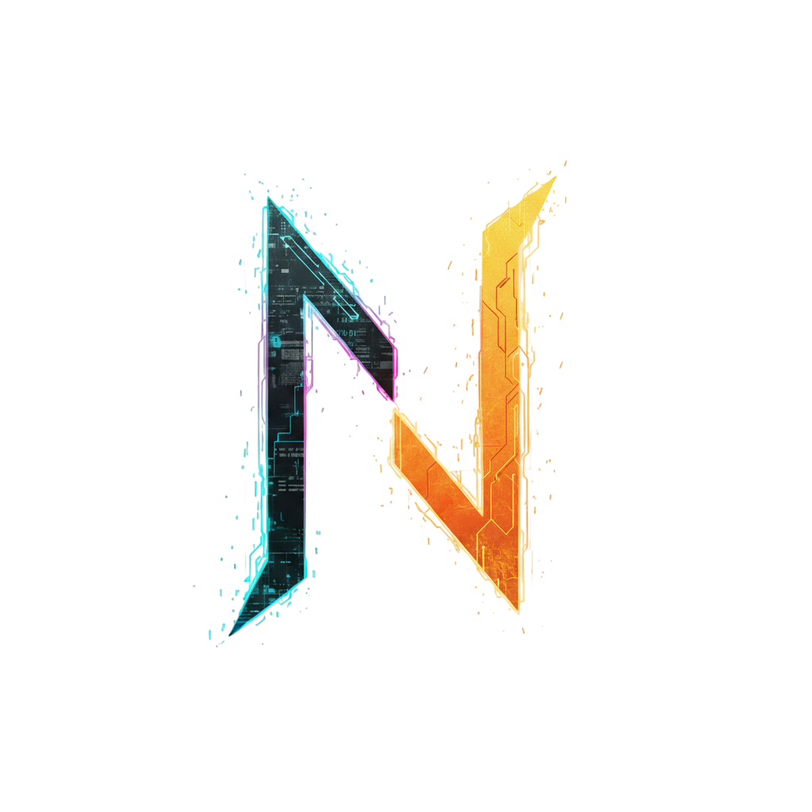
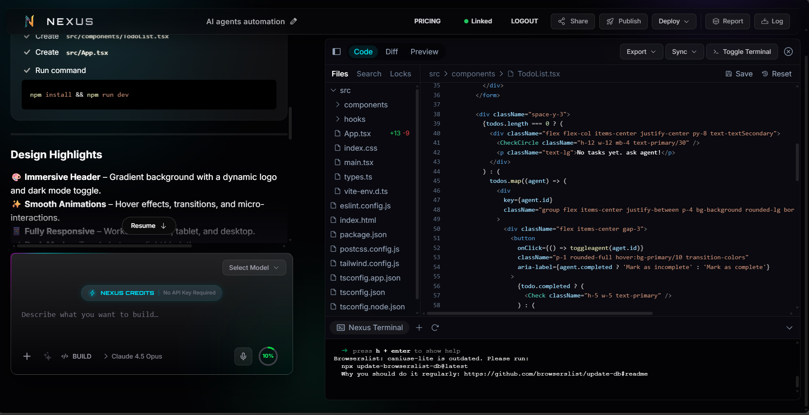

  

# Nexus

**Nexus** is an advanced, AI-powered full-stack web development platform.
**Accessible directly from your browser**, Nexus provides a powerful, zero-setup
IDE with deep cloud integrations, allowing developers to build, deploy, and
manage production-ready applications in minutes.

> **Note**: Nexus is a **closed-source** product. This repository serves as the
> central hub for our public roadmap, feature requests, and community
> discussions.

## 🎯 Who Nexus Is For

- Founders shipping MVPs at production quality
- Teams building full-stack apps without infra overhead
- Engineers who want speed without sacrificing control

---

## 🎥 See Nexus in Action

Experience the power of Nexus firsthand. Click below to watch the demo:

---

## 🗺️ Roadmap

We are constantly evolving. Here is a look at what we have delivered, what we
are building now, and what's on the horizon.

### 🟢 Now (Available)

_Features currently available in early access builds / internal testing._

- **Your IDE Lives in the Browser** — A full, production-grade development
  environment that runs entirely in your browser. No installs. No setup. Open
  Nexus and start building.

- **One Platform. Every Major AI Model.** — Access **19+ AI providers**
  including OpenAI, Anthropic, Google, Groq, xAI, DeepSeek, Mistral, Cohere,
  Together, Perplexity, HuggingFace, Ollama, LM Studio, OpenRouter, Moonshot,
  Hyperbolic, GitHub Models, Amazon Bedrock, and OpenAI-compatible endpoints.
  Switch models instantly — even mid-conversation.

- **Supabase, Built Right In** — Authentication, database, and subscriptions are
  ready from day one. Your backend is already wired before you write a single
  line of code.

- **One-Click Deploy** — Deploy instantly to Netlify, Vercel, or GitHub Pages.
  No CI configuration. No deployment friction. Just ship.

- **Talk to Build** — Voice prompting lets you turn spoken ideas into working
  code. Hands-free development that actually works.

- **Prompt with Images** — Attach screenshots, designs, or UI mockups directly
  to prompts. Nexus understands visual context — fewer explanations, better
  output.

- **MCP (Model Context Protocol)** — Next-generation tool integration that gives
  AI deeper context and awareness of your project. Smarter decisions, not just
  faster text.

- **Templates to Launch Fast** — Curated, production-ready starter projects so
  you move from idea to running app in seconds, not hours.

- **Go Mobile with Expo** — First-class React Native and Expo support. Build iOS
  and Android apps without leaving Nexus.

- **Memory That Actually Works** — Smart chat history with time-based grouping,
  instant search, and one-click export. Your conversations become reusable
  knowledge.

- **See What AI Changed** — Diff View shows exactly what was modified, line by
  line. Full transparency, always.

- **File & Folder Locking** — Prevent conflicts when AI or teammates edit the
  same files simultaneously. Collaborate without fear.

- **Git, Seamlessly** — Clone repositories, import projects, and deploy — all
  from one place, without breaking your flow.

- **Terminal in Your Browser** — Run shell commands directly inside Nexus. No
  context switching. No local environment required.

- **Enterprise-Grade Security** — Role-based access control, audit logs, and
  secure authentication. Built for teams that take security seriously.

- **Snapshots & Restore** — Instantly roll back your project to any previous
  state. Mistakes are temporary.

- **Data Viz, Built In** — Native charts and graphs when your data needs a
  visual. No extra tooling required.

- **Bulk Chat Cleanup** — Delete conversations in batches to keep your workspace
  clean and focused.

### 🟡 Coming Soon (Next 30–90 Days)

_Features currently in active development._

- **Multi-Agent Workflows**: Orchestrated agent interactions for handling
  complex, multi-step coding tasks.
- **Error Recovery**: Robust self-correction capabilities when generation or
  execution fails.
- **Custom Knowledge Context**: Upload your own documentation and style guides
  for precise context-aware generation.
- **VS Code Sync**: Seamless state synchronization and "handoff" between the
  Nexus web IDE and VS Code.
- **Advanced Deploy Pipelines**: Customized CI/CD integration and support for
  complex deployment targets.

### 🔵 On The Horizon

_Long-term goals and research items._

- **Plugins**: A robust system for community extensions and custom workflows.
- **Collaboration**: Real-time multiplayer editing and shared team workspaces.
- **Enterprise SSO**: Scalable identity management (SAML, OIDC) for large
  organizations.
- **Fine-tuning**: Capability to train custom models on your private
  repositories.

---

## 🤝 Community & Support

Even though the code is closed-source, we believe in building _with_ our
community.

### 💡 Feature Requests

Have an idea? We want to hear it!

- Check existing
  [Issues](https://github.com/theyashhambarde/nexus-roadmap/issues) to see if
  it's already suggested.
- Open a new **Feature Request** issue to propose changes.

### 💬 Discussions (Q&A)

Need help or want to discuss best practices?

- Join our
  [Discussions](https://github.com/theyashhambarde/nexus-roadmap/discussions).
- Share your projects and workflows.

### 🐞 Bug Reports

Found something broken?

- File a **Bug Report** in Issues. Please provide reproduction steps and logs
  where possible.

---

© 2026 Nexus Technologies. All rights reserved.
